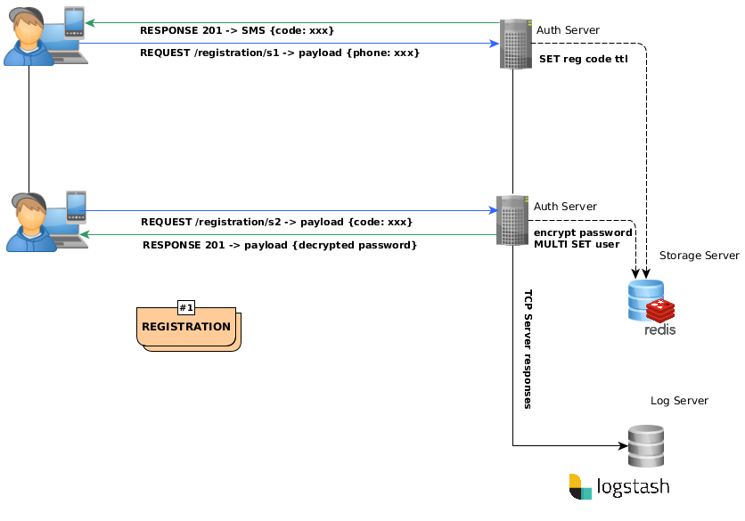
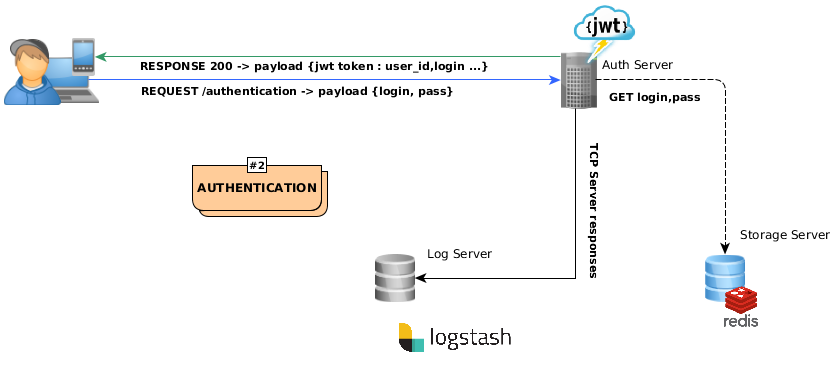
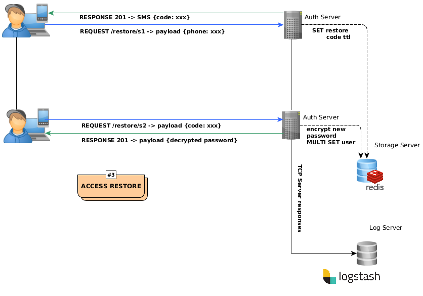

### PyRuc (Python Redis Users Controller)
PyRuc is the service for maintaining new and existing users accounts

[](https://coveralls.io/github/stanislav-web/PyRuc?branch=master) [](https://www.codacy.com/app/stanisov/PyRuc?utm_source=github.com&amp;utm_medium=referral&amp;utm_content=stanislav-web/PyRuc&amp;utm_campaign=Badge_Grade) [](https://github.com/stanislav-web/PyRuc/blob/master/LICENSE)

|  Python | Status |
|:-:|:-:|
|3.5|[](https://travis-ci.org/stanislav-web/PyRuc) |
|3.6|[](https://travis-ci.org/stanislav-web/PyRuc) |

##### What do you get out of the box?
- User's account maintenance in mode of persistent storage use
- Granting access to your internal services
- Rapid recovery access in case of loss of control

##### Requirements
- Python >= 3.5
- Redis >= 4

##### Implemented
- Gunicorn WSGI
- Gevent as default async worker for Gunicorn
- Python flask
- Twilio SMS notifier
- Logstash client as logs filter to Elastic
- JWT authentication
- Redis as persistent user's storage

##### Configuration
```bash
/app/env/development.env
/app/env/production.env
```
You also could setup your build out of the docker container.
Please install `dotenv` pip package for realize your custom environments

##### Installation
- Docker
```bash

# ENV development: using /app/env/development.env
> docker-compose --file docker-compose.dev.yml up --build

# ENV production: using /app/env/production.env
> docker-compose --file docker-compose.prod.yml up --build
```
- Manualy & Run
```bash
> cd app 
> pip install -r requirements.txt
> gunicorn -c config.py server --reload
```

##### Try API
[http://drunk-start.surge.sh](http://drunk-start.surge.sh)

##### Diagrams




#### Tests
```bash
> cd app && coverage run setup.py test
```